# Object Removal And Recolorization Within 3D Gaussian Splatting

## Introduction

This project introduces a novel framework for multi-view consistent 3D segmentation using 3D Gaussian Splatting and high-quality 2D segmentation features from SAM-HQ. Our approach enables real-time object removal and recolorization in dynamic 3D scenes, addressing challenges in mask quality and computational efficiency. By leveraging state-of-the-art 2D segmentation models and explicit 3D representations, we achieve high-precision segmentation with applications in virtual reality, robotics, and scene editing. The source code, dataset, and detailed results are available in this repository.

Our work introduces :
1. DEVA with SAM-HQ for creating high quality object mask for 3D scene segmentation.(link: https://github.com/joshir199/Video-Tracking-DEVA-With-SAM-HQ)
2. Modified differential rasterization code which includes object feature. (link: https://github.com/joshir199/object-feature-rasterization)

---
## Dataset

The 3D Segmentation HQ dataset is a curated collection of 5 real-world scenes with high-quality object segmentation masks designed for research in 3D scene understanding, editing, and rendering. This dataset improves upon existing benchmarks by providing cleaner and more consistent object masks across multiple views, enabling reliable evaluation and training for tasks such as:

- 3D semantic segmentation
- Object-level scene editing (e.g., removal, recolorization)
- 3D Gaussian Splatting with semantic supervision

Please find the dataset here: 

---
## Architecture

<figure>
  
  <figcaption>Overview of the Object mask generation pipeline which uses SAM-HQ for mask generation and DEVA for
object tracking to ensure consistent segmentation across views via bi-directional temporal propa-
gation of mask IDs..</figcaption>
</figure>

&nbsp;

<figure>
  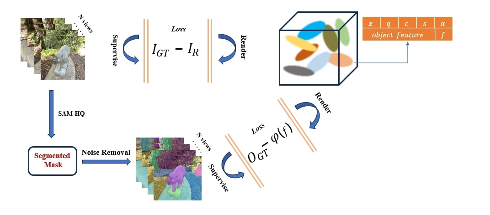
  <figcaption>Overview of the object feature-based 3D Gaussian Splatting training, where highquality
object masks are generated for each image IGT across N views using SAM-HQ assisted
video tracking DEVA, followed by preprocessing to ensure cleaner and multi-view consistent
masks. During training, per-Gaussian object features of dimension 16 are jointly trained with
other Gaussian parameters, mapped via a linear layer ϕ(f) to 256-dimensional class probabilities,
and supervised using the ground truth masks labels OGT. This enables label-aware 3D Gaussian
splatting for interactive scene editing.</figcaption>
</figure>

&nbsp;

<figure>
  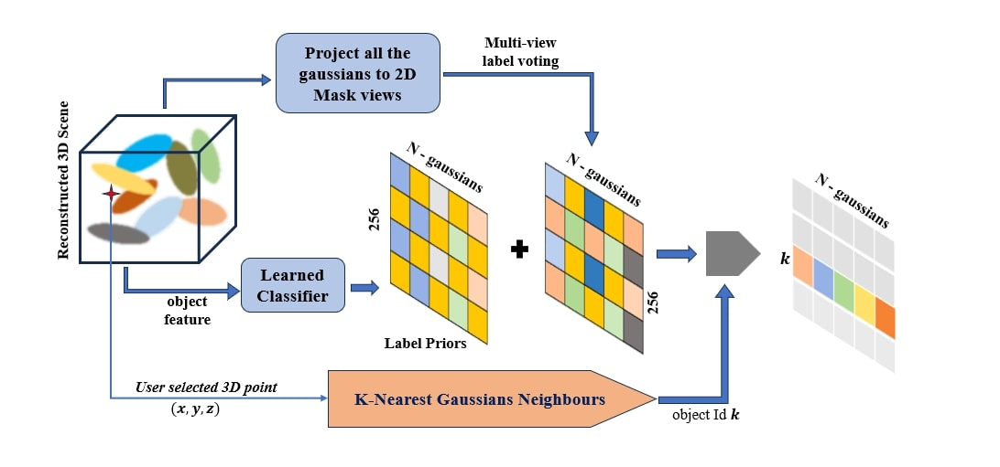
  <figcaption>Prior-based label reassignment: The figure illustrates our novel pipeline for label
reassignment, where a user-selected point (x, y, z) in the reconstructed 3D Gaussian Splatting
scene is used to collect K-nearest Gaussian neighbors for object identification. In parallel, 3D
Gaussians are projected onto the ground-truth object masks to compute label voting, which is
combined with learned label priors to form a label matrix R256×num gaussians; the final binary mask
for object k is then extracted by selecting all Gaussians that maximally contribute to the chosen
object k.</figcaption>
</figure>

---

## Results

### Tabular Results

<figure>
  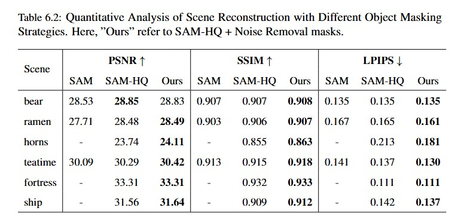
</figure>

&nbsp;

<figure>
  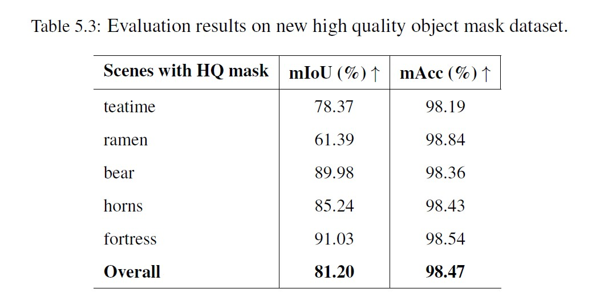
</figure>

&nbsp;

<figure>
  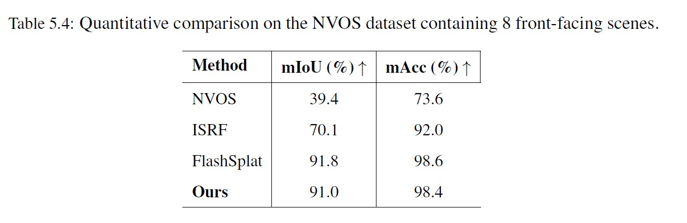
</figure>

&nbsp;

<figure>
  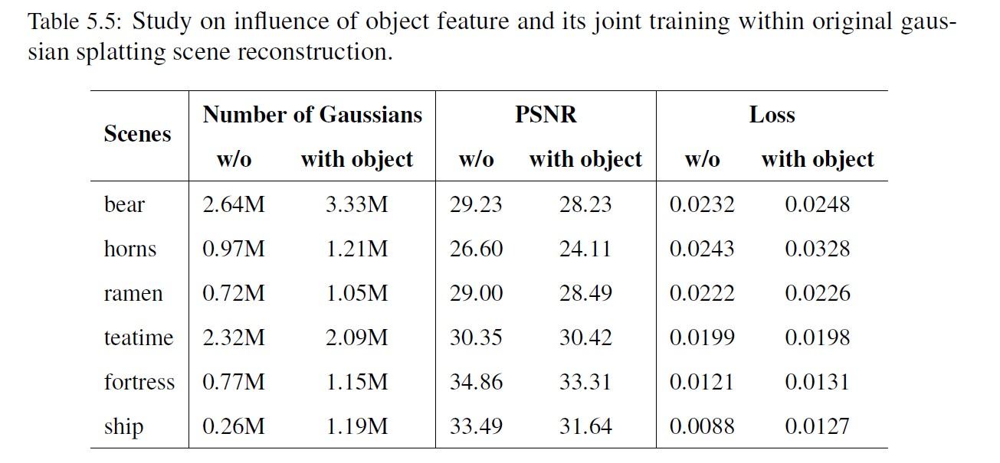
</figure>

---

## Image Results

<figure>
  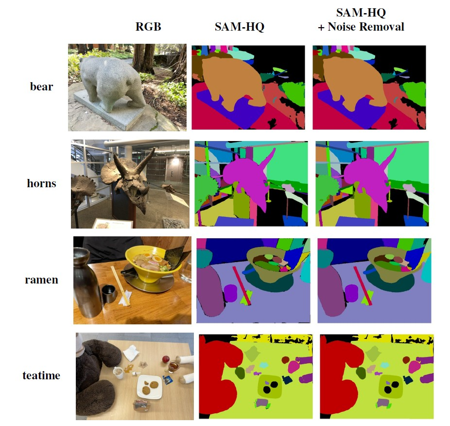
  <figcaption>Figure 1: Segmentation result showing precise object boundaries.</figcaption>
</figure>

&nbsp;

  
<figure>
  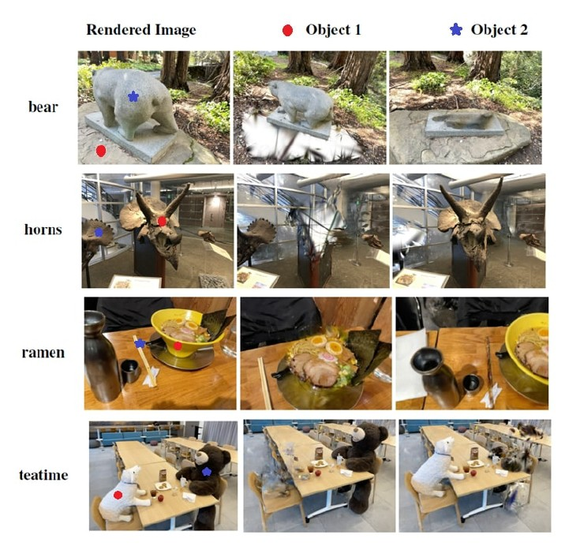
  <figcaption>Figure 2: Object removal using our method.</figcaption>
</figure>

&nbsp;
&nbsp;
  
<figure>
  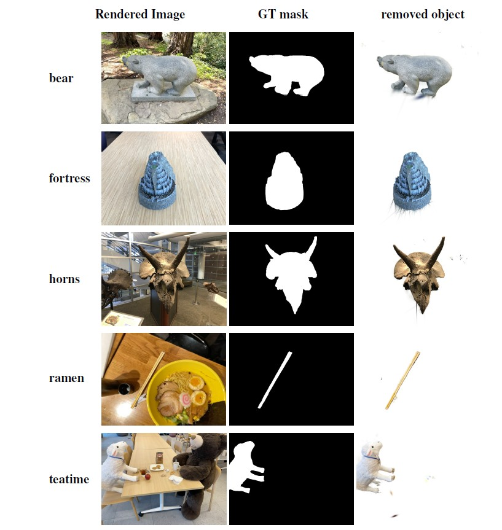
  <figcaption>Figure 3: Extraction of objects while maintaining multi-view consistency.</figcaption>
</figure>

  &nbsp;
  
<figure>
  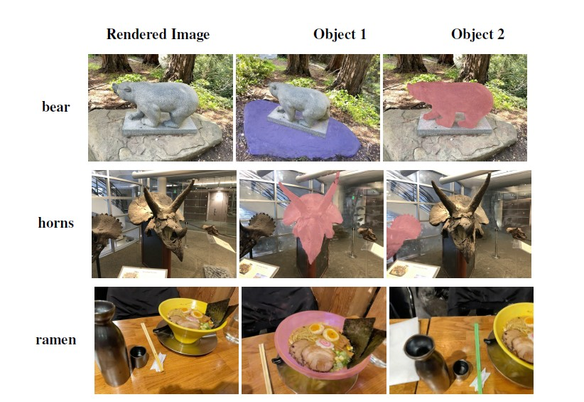
  <figcaption>Figure 4: Recolorization of objects  while maintaining multi-view consistency.</figcaption>
</figure>

&nbsp;

  
<figure>
  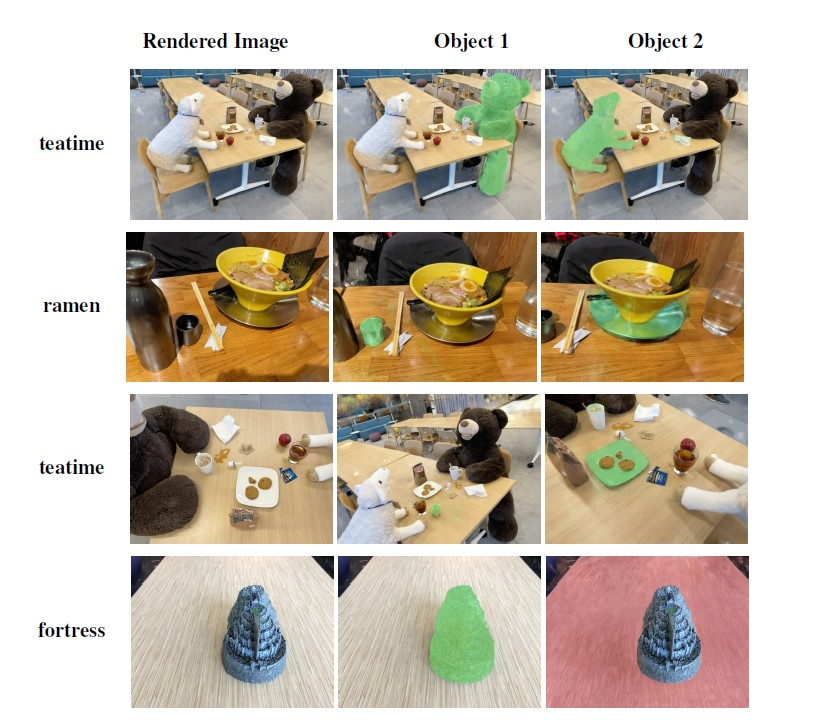
  <figcaption>Figure 5: Recolorization of objects  while maintaining multi-view consistency.</figcaption>
</figure>

---
# Video results

Following results shows the ooutput of editing task like recolor, object removal and object extraction on 3D scene. 
The displayed results covers the quality by rendering all the views for various scene and tasks mentioned as "scene_name [task_name]"


<table>
  <tr>
    <td align="center">
      <br>
      <b>bear [recolor]</b>
    </td>
    <td align="center">
      <br>
      <b>bear [removed]</b>
    </td>
    <td align="center">
      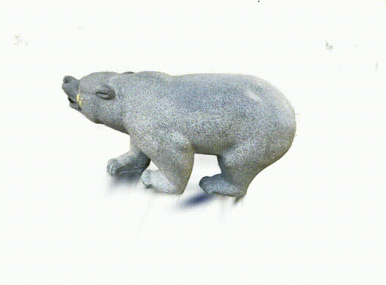<br>
      <b>bear [extracted]</b>
    </td>
  </tr>
  <tr>
    <td align="center">
      <br>
      <b>fortress [recolor]</b>
    </td>
    <td align="center">
      <br>
      <b>fortress [removed]</b>
    </td>
    <td align="center">
      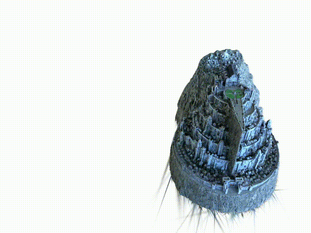<br>
      <b>fortress [extracted]</b>
    </td>
  </tr>
  <tr>
    <td align="center">
      <br>
      <b>horn [recolor]</b>
    </td>
    <td align="center">
      <br>
      <b>horn [removed]</b>
    </td>
    <td align="center">
      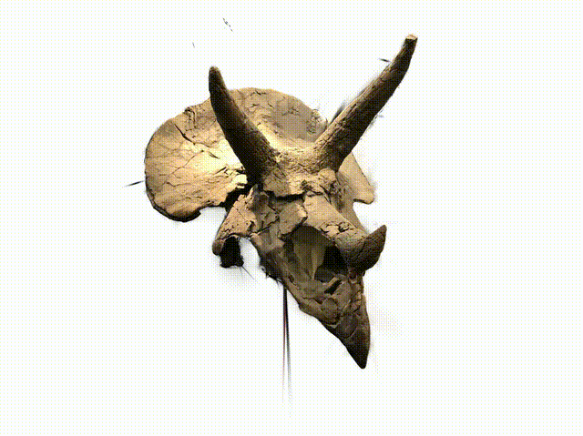<br>
      <b>horn [extracted]</b>
    </td>
  </tr>
  <tr>
    <td align="center">
      <br>
      <b>ramen [recolor]</b>
    </td>
    <td align="center">
      <br>
      <b>ramen [removed]</b>
    </td>
    <td align="center">
      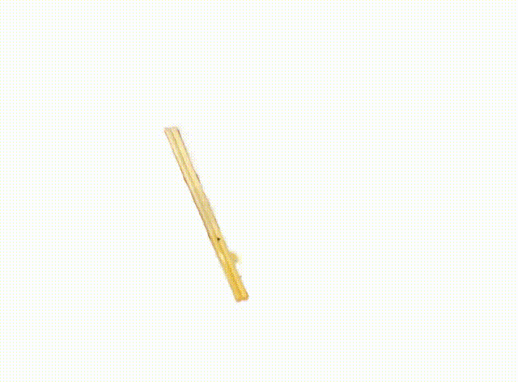<br>
      <b>ramen [extracted]</b>
    </td>
  </tr>
  <tr>
    <td align="center">
      <br>
      <b>teatime [recolor]</b>
    </td>
    <td align="center">
      <br>
      <b>teatime [removed]</b>
    </td>
    <td align="center">
      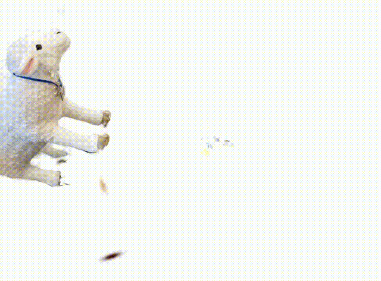<br>
      <b>teatime [extracted]</b>
    </td>
  </tr>
</table>


---
---
## Step-by-step tutorial for running the project

### Cloning the Repository
The repository contains submodules, thus please check it out with 
```shell
# SSH
git clone git@github.com:joshir199/Object-Removal-And-Recolorization-Within-3D-Gaussian-Splatting.git --recursive
```
or
```shell
# HTTPS
git clone https://github.com/joshir199/Object-Removal-And-Recolorization-Within-3D-Gaussian-Splatting.git --recursive
```

### Optimizer

The optimizer uses PyTorch and CUDA extensions in a Python environment to produce trained models same as official 3D-GS repo.

### Hardware Requirements

- CUDA-ready GPU with Compute Capability 7.0+
- 16 GB VRAM (to train on mentioned dataset) (Note: For larger dataset, refer to official 3D-GS repo)

### setup
Please follow the setup steps from official 3D-GS repo to build environment and initial configuration.

### running
To run the training code for object feature based training, simply use

```shell
python train.py -s <path to COLMAP or NeRF Synthetic dataset>  -m <path to saving model> --config_file < path to configuration file> --wandb_name <Experiment_name>

```
While other training argument details can be refered from official 3D-GS repo.
Note that similar to MipNeRF360 and official 3D-GS repo, we target images at resolutions in the 1-1.6K pixel range. For convenience, arbitrary-size inputs can be passed and will be automatically resized if their width exceeds 1600 pixels. We recommend to keep this behavior, but you may force training to use your higher-resolution images by setting ```-r 1```.


### rendering
To render the trained 3D Gaussian Splatting on editing task like object removal and recolorization, use below command:

Object removal for given object ID:
```shell
python object_editing.py --model_path <path to pre-trained model> --iteration 30000 --source_path <path to COLMAP dataset> --view_num -1 --obj_num 255 --white_background --obj_id <OBJECT_ID> --skip_test  
```
Object removal for given object ID:
```shell
python object_editing.py --model_path <path to pre-trained model> --iteration 30000 --source_path <path to COLMAP dataset> --view_num -1 --obj_num 255 --white_background --selcted_3d_point <3d cooridinate in list form i.e : [x, y, z]> --skip_test  
```

Object recolorization for given object ID:
```shell
python object_editing.py --model_path <path to pre-trained model> --iteration 30000 --source_path <path to COLMAP dataset> --view_num -1 --obj_num 255 --white_background --obj_id <OBJECT_ID> --skip_test --task recolor
```
Object recolorization for given object ID:
```shell
python object_editing.py --model_path <path to pre-trained model> --iteration 30000 --source_path <path to COLMAP dataset> --view_num -1 --obj_num 255 --white_background --selcted_3d_point <3d cooridinate in list form i.e : [x, y, z]> --skip_test --task recolor
```
Note: More details on the arguments similar to render.py can be found on official 3D-GS repo

-------
## Reference Links

This project is built upon the great works of previous projects in the field of 3D Gaussian Splatting research.
I want to acknowledge and thanks them for keeping it open-source for future research works.

1. Official 3D Gaussian splatting (3D-GS) : https://github.com/graphdeco-inria/gaussian-splatting
2. Track Anything with DEVA : https://github.com/hkchengrex/Tracking-Anything-with-DEVA
3. FlashSplat : https://github.com/florinshen/FlashSplat
4. Segment Anything in High Quality : https://github.com/SysCV/sam-hq

---
